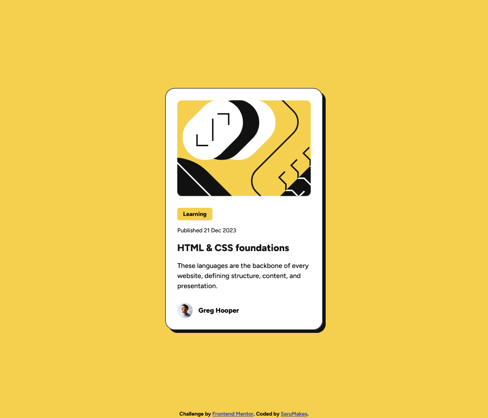

# Frontend Mentor - Blog preview card solution

This is a solution to the [Blog preview card challenge on Frontend Mentor](https://www.frontendmentor.io/challenges/blog-preview-card-ckPaj01IcS). Frontend Mentor challenges help you improve your coding skills by building realistic projects. 

## Table of contents

- [Foreword](#foreword)
- [Project Overview](#project-overview)
  - [The challenge](#the-challenge)
  - [Screenshot](#screenshot)
  - [Links](#links)
- [My process](#my-process)
  - [Built with](#built-with)
  - [What I learned](#what-i-learned)
  - [Continued development](#continued-development)
  - [Useful resources](#useful-resources)
- [Author](#author)
- [Acknowledgments](#acknowledgments)

## Foreword

I'm a very new and inexperienced front-end developer - hell, it feels wild to even call myself that already - who is trying to learn as much as possible from each project I take on. In order to organise my thoughts, and to try to make my approach as systematic as possible, I try to keep a journal of what I'm doing along the way, to take time to stop and review what I've done and what I'll be doing next.

I'm unfamiliar with the usual manner of writing README's like this, so the overall style and tone might be different from what more experienced readers might expect. Since this is as much a journal to myself, as it is a description for you as a reader, you might notice that my language will at times be quite conversational. You might also see me writing things that might be entirely obvious or completely wrong. 

This is all part of the process for me, and you, my dear reader, are simply offered the chance to get a glimpse into my thoughts on this entire project.

## Project Overview

### The challenge

Users should be able to:

- See hover and focus states for all interactive elements on the page

### Screenshot



### Links

- Solution URL: [Frontendmentor.io](https://your-solution-url.com)
- Live Site URL: [Github.io](https://sarumakes.github.io/blog-preview-card-main/)

## My process

### Initial thoughts

Looking at the Figma design file, I'm first of all seeing one main component, the blog preview card. Inside it, I'm envisioning perhaps three main containers: one for the image, one for the text content (with multiple nested containers within) and one for the "footer" with the userimage and name. I might use flexbox, but I'll have to see what I end up using, as I make my way through the coding.

I'll be trying to build this using a Mobile-first workflow, which I will read up on before starting on the coding itself. Judging from the design files, there will not be a massive difference between the mobile and desktop versions. 

The design specifies that there will need to be an active state, when you hover over the blog title, which will be a very interesting challenge. I have never created a component like this before, so I will be needing to study how to this. At first glance, I can see that the active state needs to change color of the headline, as well as having the entire component seem as if it is lifting off of the background, with the shadow moving further "away". Perhaps this will require some sort of animation.

### Built with

- Semantic HTML5 markup (or attempted to anyway)
- CSS custom properties
- Flexbox
- CSS variables
- Mobile-first workflow

**Note: These are just examples. Delete this note and replace the list above with your own choices**

### What I learned

Use this section to recap over some of your major learnings while working through this project. Writing these out and providing code samples of areas you want to highlight is a great way to reinforce your own knowledge.

While this challenge helped strengthen my skills in HTML and CSS, I also learned many new things. Here are some examples:

#### CSS Variables

As I was studying some of the concepts I needed to know for the project, I came across CSS variables. I learned just a tiny fraction of how powerful and useful they can be. In the case of my project, I learned how to use them to declare main design colors once, and then reuse said variables again and again throughout the project. 

The cool thing is, if you weren't aware already, that you can use it to change the color in all places where you used that color variable, by simply changing the initial variable declaration. Imagine that you chose a particular green color for certain backgrounds throughout your project, but later on you realise that it's just not the right shade of green. Instead of having to go through every single element to change the color, you can simply change the color that's assigned to the original variable declaration, and then it will automatically apply the new shade of green to all the areas you were using the old shade of green.

I find this incredibly useful and I hope you will too. This is how I did it in my project:

``` 
:root {
    --yellow: hsl(47, 88%, 63%);
    --white: hsl(0, 0%, 100%);
    --grey: hsl(0, 0%, 50%);
    --black: hsl(0, 0%, 7%);
}
```

This applies the variable to the entire site, so that you can use the colors everywhere. It is also possible to set variables that apply only to specific elements, but I haven't explored this option further. It is the ```:root``` portion specifically which applies the variables to the entire site.

In the example above, I then declared ```--[variable name]``` followed by the value I want the variable to refer to. Simply replace ```[variable name]``` with whatever name you decide to name your variable. 

To use the variable, you then simply declare it instead of the color (or other property/value) that you want, by writing ```var(--[variable name])```. This is what it looks like in action:

```
body {
    background-color: var(--yellow);   
```

So, I'm using the variable to refer to the color chosen earlier, which I can then change to any other color after the fact, should I so choose, without having to go through and change the color in every single instance I used it previously.


#### Mobile-First workflow

While I am still very new to this. I learned more about Mobile-First workflows, and how it differs from responsive design. As I understand it, a big part of what makes it different, is that Mobile-First - as the name suggests - focuses on developing a website/an app for mobile devices first, before then turning towards adjusting the design for desktop devices.

The reasoning is that with a regular responsive design workflow, the mobile version can end up seeming like more of an afterthought. You work your way down through the device widths, and perhaps just make changes to the layout so that the desktop design sorta fits within the mobile device width. 

With Mobile-First, we're turning this idea on its head, and instead focus on creating the best possible experience for mobile users first. We focus on useability, speed/performance, etc. to ensure that mobile users get the best or at least just as good of an experience with the site/app as any desktop user would. Afterwards we then expand upon our design and make changes to how the same content is shown to desktop users.

In practise, for this simple project, it meant that I wrote the entire site for mobile devices first, and then created @media queries for larger screen widths.


#### Transitions, transforms and hover/active

In order to achieve the design specs with varying shadows, and a hover effect for the headline, I studied transitions, transforms and hover/active states. I found it to be a very interesting topic, which I really look forward to studying more, and using in future projects.

What I did for this project was to give the main preview-card container a hover effect, where I both increase the distance of the box-shadow, as well as slightly translating (moving) the card in the opposite direction. The intent is to give the impression that the card is lifting off of the background a bit as you hover over it. I imagine it might look quite interesting on a page with many other similar preview cards.

My code looks like this:

```
.preview-card {
    display: flex;
    flex-direction: column;
    align-items: flex-start;
    width: 20.4375rem;
    height: auto;
    padding: 1.5rem;
    gap: 1.5rem;
    background-color: var(--white);
    border: 1px solid var(--black); /*I decided to use pixels, as I don't want the border to scale*/
    border-radius: 1.25rem;
    box-shadow: 0.4rem 0.4rem 0 var(--black);
    transition: box-shadow 250ms ease-in-out, 
                transform 250ms ease-in-out;
}

.preview-card:hover {
    box-shadow: 0.8rem 0.8rem 0 var(--black);
    transform: translate(-0.2rem, -0.2rem);
}

```

I had initially added the transition (the thing that does the animation) to the .preview-card:hover, but realised that it caused the card to instantly snap back to the original look, as soon as I no longer hovered a cursor over the element. By applying it to the main element instead, it now smoothly repeats the animation when you don't hover your cursor over it.

There's a whole field of science (sorta) dedicated to the art of doing these types of animations, but for now I opted for a simple ease-in-out animation for the project.


### Continued development

I'm definitely looking forward to learning more about CSS variables and transitions, as they just seem supremely fun to me. I really enjoyed playing around with and learning about those concepts. 

I've learned a bit about the ```clamp``` function as well, when researching ways to change font sizes without using @media queries. However, it seems that the function has some limitations, when it comes to allowing the user to increase the font sizes in the browser, as the function effectively caps the maximum font size. As such, I opted to stick with media queries for this challenge.I would like to explore this topic more, and get some experience testing this concept though.

### Useful resources

- [CSS transforms](https://www.joshwcomeau.com/css/transforms/) - Josh's very informative and well-written guide to CSS transforms (and a whole host of other great articles) was a great help to me. I highly recommend you check out his blog.
- [MDN Docs - Custom CSS Properties](https://developer.mozilla.org/en-US/docs/Web/CSS/Using_CSS_custom_properties) - This is a great source of information on how to work with CSS variables/custom CSS properties.

## Author

- Website - [SaruMakes](https://sarumakes.github.io)
- Frontend Mentor - [@SaruMakes](https://www.frontendmentor.io/profile/SaruMakes)
